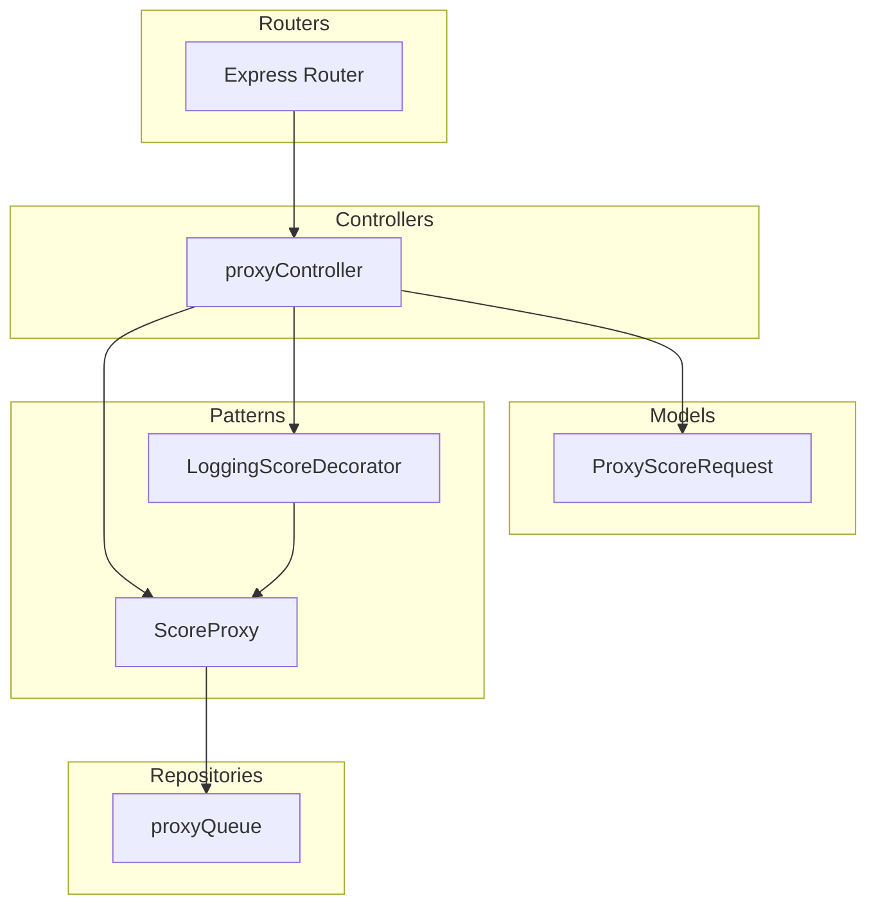

# Proxy e Outros Padrões de Projeto ☁🌩
Resolução de desafio de Técnicas Avançadas de Desenvolvimento de Software - Padrões de Projeto. 
Veja mais detalhes no pdf de [Descrição do Desafio](./ChallengeDescriptionProxy.pdf).

Trabalho desenvolvido em dupla por [Soraya Ferreira](https://github.com/SorayaFerreira) e [Sophya Ribeiro](https://github.com/sophya-ribeiro).


## Instruções para execução e teste do serviço

- Faça um clone do projeto [https://github.com/SorayaFerreira/proxy-pattern](https://github.com/SorayaFerreira/proxy-pattern):

```bash
git clone https://github.com/SorayaFerreira/proxy-pattern
```
- Rode os seguintes comandos:

```bash
npm i
npm run compile
npm run dev
```

- Abra uma aplicação para teste de API, como Postman ou Bruno, por exemplo. 
- Crie uma requisição com a seguinte URL (exemplo): `https://score.hsborges.dev/api/score?cpf=054.816.520-30` e um client-id. 
- Execute a requisição e obsere a Response.

## Diagrama Arquitetural

Digrama simples com [Mermaid](https://mermaid.js.org/syntax/flowchart.html) representando a arquitetura adotada neste projeto:



## Design Patterns
A implementação de padrões de projeto limitou-se a dois: `Decorator` e `Proxy`. Ambos pareceram ser os padrões mais intuitivos e aplicáveis para o serviço em questão, que é bastante simples. 
- O padrão _Proxy_ é bastante esperado por ser a implementação do desafio esperado em si. 
- Já o padrão _Decorator_ se encaixou por ser aplicável sem necessidade de muitas alterações em módulos que já haviam sido criados sem seguir padrão algum.
